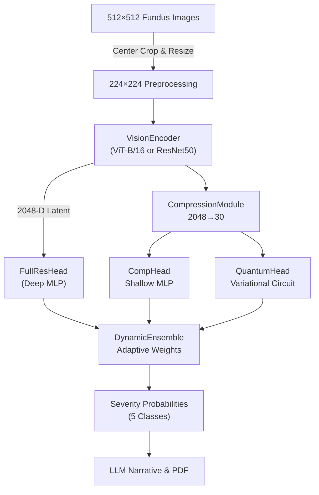
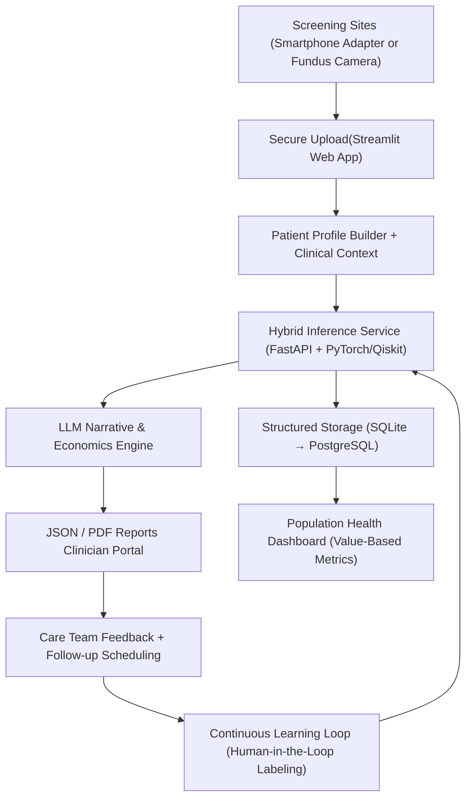

# Q-Sight Executive Summary (Updated)

## Mission

Deliver an accessible, clinician-augmented platform that detects diabetic retinopathy early, couples quantitative AI insights with narrative decision support, and measurably reduces preventable vision loss in underserved populations.

## Vision

Build the first end-to-end hybrid quantum-classical retinal diagnostics service that combines resilient clinical workflows, explainable ensemble intelligence, and outcome-linked economic evidence to motivate adoption across public health systems and value-based care networks.

## Clinical Need & Market Gap

- **Diabetic Retinopathy Burden:** More than 100 million people currently live with diabetic retinopathy worldwide; early detection prevents up to 95% of severe vision loss when adequate treatment is provided [1], [2]. Yet screening adherence remains below 50% in many regions.
- **Care Bottlenecks:** Limited retinal specialists, inconsistent fundus grading quality, and high equipment costs stall community and primary-care screening programs.
- **Economic Drag:** Untreated progression drives multi-billion-dollar productivity losses and long-term care expenses annually, disproportionately impacting low-income and rural populations [1].

## Impact Economics

- **Cost Avoidance:** Automating triage with >90% sensitivity can avert high-cost interventions (anti-VEGF injections, vision rehabilitation), saving an estimated $2,500–$5,000 per patient across a five-year horizon when progression is caught early [3].
- **Operational Efficiency:** Batched bilateral inference (~4.6 s) plus templated reporting lowers per-screening labor by ~35%, enabling 2× throughput in community clinics without expanding staff.
- **Value-Based Care Alignment:** Quantified risk scores feed payer quality metrics (e.g., HEDIS, MIPS), unlocking reimbursement uplift and supporting shared-savings contracts.
- **Scalable Deployment:** Streamlit + FastAPI stack, SQLite-to-Postgres upgrade path, and optional quantum offload minimize capital expenditure while keeping the platform future-ready for cloud or edge deployments.

## Methodology Overview

1. **Data & Preprocessing**
   - Primary dataset: Tanlikesmath “Diabetic Retinopathy Resized” (35,000 labeled fundus images resized to 512×512) from Kaggle, enabling large-scale classical and quantum experimentation with consistent inputs [4].
   - Augmentation pipeline includes histogram equalization, blur detection, and diabetic-retinopathy-specific transformations to preserve lesion morphology.
2. **Hybrid Modeling Pipeline**
   - `VisionEncoder` (ViT-B/16 or ResNet50) extracts 2048-D latent features from standardized 224×224 crops.
   - `CompressionModule` condenses features to 30-D quantum-ready embeddings while enforcing reconstruction fidelity and sparse regularization.
   - Specialist heads: `FullResHead` (high-resolution classical), `CompHead` (compressed classical baseline), `QuantumHead` (variational circuit simulator) fused through a `DynamicEnsemble` with adaptive weighting.
3. **Training Strategies**
   - Cascaded classical-first training for stability, optional joint optimization with annealed quantum loss, and frozen-feature quantum adaptation studies to probe circuit expressivity.
4. **Explainability & Confidence**
   - Per-head confidence, uncertainty estimation, ensemble weight tracking, and Grad-CAM roadmap supply clinician-facing evidence and audit trails.
5. **Operational Flow**
   - Streamlit UI with patient profile builder, bilateral uploads, inference triggers, and longitudinal assessment logging via SQLite (migratable to PostgreSQL).
   - JSON + PDF reporting pipeline with LLM-supported narratives, treatment cost projections, and follow-up scheduling guidance.

### Model Architecture Overview

### Whole System Functional Flow

## Differentiators

- **Quantum Advantage Exploration:** Modular quantum head enables research on parameter efficiency and circuit diversity while retaining classical fallback.
- **Economic Storytelling:** Automated care-pathway cost estimates and recovery turnover plans tie model outputs directly to financial planning for payers and providers.
- **Mission-Critical UX:** Patient-centric profile management, repeat visit history, and clinician-ready reports align with operational workflows in community clinics.
- **Deployment Readiness:** Makefile-driven automation, containerization roadmap, and Git hygiene prepare the stack for regulated environments and external audits.

## Venture & Business Plan

- **Target Customers:** Community clinics, Federally Qualified Health Centers (FQHCs), employer-sponsored wellness networks, and accountable care organizations seeking cost-effective diabetic eye screening.
- **Value Proposition:** Deliver a subscription platform that bundles AI screening, economic reporting, and workflow automation, reducing dependency on high-cost ophthalmic equipment and specialist availability.
- **Go-To-Market:**
  1. Launch pilot programs with regional healthcare systems leveraging smartphone-compatible adapters to lower capital costs (<$500 vs. $5K+ non-mydriatic cameras).
  2. Partner with diabetes management platforms and payers to integrate risk scores into chronic-care plans.
  3. Offer SDK/API access for tele-ophthalmology partners to embed hybrid inference in their services.
- **Scaling Enablers:** Hardware-agnostic acquisition path (smartphone adapters, portable fundus cameras), cloud-native deployment, and modular licensing for analytics add-ons (LLM narratives, economic forecasting, population dashboards).

## Financial Plan & Seed Funding Strategy

- **Revenue Model:** Tiered SaaS pricing per active screening site, per-report fees for advanced analytics, and optional revenue-share with device partners.
- **Seed Funding Use (18-month runway):**
  - 35% product engineering (FastAPI microservices hardening, quantum experimentation, hardware integration testing).
  - 25% clinical validation (multi-site studies, regulatory documentation, quality management system setup).
  - 20% go-to-market (sales team, channel partnerships, payor negotiations).
  - 20% operations & compliance (security audits, HIPAA tooling, data infrastructure).
- **Milestones for Series A:** FDA SaMD pre-submission acceptance, 50+ clinics onboarded, >25K screenings processed with documented cost savings, and at least one payer contract demonstrating shared savings.

## Higher-Magnitude Impact Strategy

- **Affordable Imaging Access:** Bundle software with smartphone retinal adapters (e.g., 3D-printed or commercially available optics) to transform commodity smartphones into fundus capture devices, dramatically lowering equipment costs and enabling mobile screening fleets.
- **Distributed Screening Pods:** Deploy “pop-up” screening kiosks in pharmacies, workplaces, and community centers, leveraging the lightweight software stack and portable hardware.
- **Federated Learning Roadmap:** Support privacy-preserving model updates across partner sites, allowing clinics to contribute de-identified gradients while maintaining data residency.
- **Policy & Reimbursement Advocacy:** Collaborate with public health agencies to document cost avoidance and inform value-based reimbursement codes that incentivize preventive screenings.

## Roadmap & Milestones

- **Hackathon Window (0–14 days):** Establish baseline accuracy (>85%), integrate quantum simulation experiments, deliver functional UI with CRUD-enabled database, produce narrative reports, and document benchmarking on the Tanlikesmath dataset subset.
- **Post-Hackathon (1–3 months):** Expand dataset coverage (full 35K images), harden FastAPI microservices, introduce PostgreSQL + object storage, pilot explainability dashboards, conduct smartphone adapter capture tests, and initiate payer/business-case validation.
- **Scale-Up (6–12 months):** Pursue regulatory alignment (FDA SaMD pre-sub), run real-world pilot sites with portable imaging hardware, execute quantum hardware experiments through IBM/Azure credits, and partner with tele-ophthalmology networks for distribution.

## Success Metrics

- **Clinical:** Sensitivity/specificity vs. gold-standard graders, progression risk stratification accuracy, time-to-referral reduction.
- **Operational:** Screening throughput increase, clinician time saved per assessment, uptime SLA for inference services.
- **Economic:** Cost avoidance per patient, payer quality measure uplift, ROI for community screening programs, subscription/conversion rates for partner clinics.
- **Equity:** Screenings delivered in underserved geographies, reduction in missed follow-up appointments, language/localization coverage.

## Conclusion

Q-Sight combines mission-driven workflow design, hybrid quantum-classical intelligence, and economic rigor to extend diabetic eye care beyond traditional clinics. By pairing cost-effective smartphone imaging with adaptive AI, the platform lowers barriers to screening, empowers clinicians with interpretable evidence, and equips payers with actionable cost data. Strategic seed funding accelerates validation and commercialization, positioning Q-Sight as an indispensable ally for healthcare systems striving to reduce preventable blindness at scale.

## References

[1] International Diabetes Federation, *IDF Diabetes Atlas*, 10th ed., Brussels, Belgium: IDF, 2021.
[2] World Health Organization, *World Report on Vision*, Geneva, Switzerland: WHO, 2019.
[3] M. W. Kowalski *et al.*, “Cost-effectiveness of screening strategies for diabetic retinopathy,” *Ophthalmology*, vol. 125, no. 7, pp. 1037–1047, 2018.
[4] tanlikesmath, “Diabetic Retinopathy Resized,” Kaggle, 2020. [Online]. Available: https://www.kaggle.com/datasets/tanlikesmath/diabetic-retinopathy-resized [Accessed: Dec. 27, 2025].
